# adventofcode

<!-- AOC TILES BEGIN -->
<h1 align="center">
  2024 - 26 ⭐
</h1>
<a href="https://github.com/jenarvaezg/aoc2024/tree/main/solutions/day01.py">
  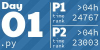
</a>
<a href="https://github.com/jenarvaezg/aoc2024/tree/main/solutions/day02.py">
  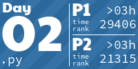
</a>

<a href="https://github.com/jenarvaezg/aoc2024/tree/main/solutions/day05.py">
  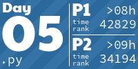
</a>

<a href="https://github.com/jenarvaezg/aoc2024/tree/main/solutions/day11.py">
  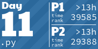
</a>
<a href="https://github.com/jenarvaezg/aoc2024/tree/main/solutions/day12.py">
  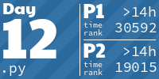
</a>
<a href="https://github.com/jenarvaezg/aoc2024/tree/main/solutions/day13.py">
  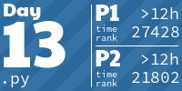
</a>
<h1 align="center">
  2023 - 21 ⭐
</h1>
<a href="https://github.com/jenarvaezg/aoc2023/tree/main/solutions/day01.py">
  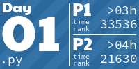
</a>
<a href="https://github.com/jenarvaezg/aoc2023/tree/main/solutions/day02.py">
  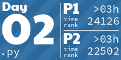
</a>
<a href="https://github.com/jenarvaezg/aoc2023/tree/main/solutions/day03.py">
  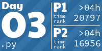
</a>
<a href="https://github.com/jenarvaezg/aoc2023/tree/main/solutions/day04.py">
  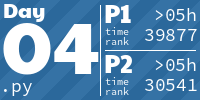
</a>

<a href="https://github.com/jenarvaezg/aoc2023/tree/main/solutions/day07.py">
  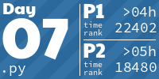
</a>
<a href="https://github.com/jenarvaezg/aoc2023/tree/main/solutions/day08.py">
  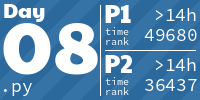
</a>

<h1 align="center">
  2022 - 32 ⭐
</h1>

<a href="https://github.com/jenarvaezg/aoc2022/tree/main/src/solutions/day11.rs">
  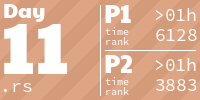
</a>

<h1 align="center">
  2021 - 36 ⭐
</h1>

<a href="https://github.com/jenarvaezg/aoc2021/tree/main/days/02/day02.go">
  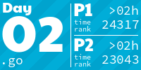
</a>
<a href="https://github.com/jenarvaezg/aoc2021/tree/main/days/03/day03.go">
  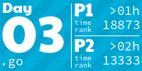
</a>

<a href="https://github.com/jenarvaezg/aoc2021/tree/main/days/11/day11.go">
  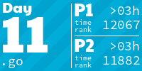
</a>
<a href="https://github.com/jenarvaezg/aoc2021/tree/main/days/12/day12.go">
  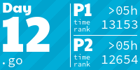
</a>
<a href="https://github.com/jenarvaezg/aoc2021/tree/main/days/13/day13.go">
  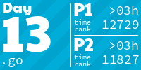
</a>
<a href="https://github.com/jenarvaezg/aoc2021/tree/main/days/14/day14.go">
  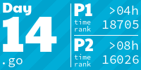
</a>
<a href="https://github.com/jenarvaezg/aoc2021/tree/main/days/15/day15.go">
  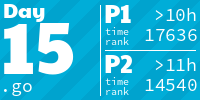
</a>

<a href="https://github.com/jenarvaezg/aoc2021/tree/main/days/17/day17.go">
  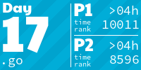
</a>
<a href="">
  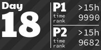
</a>
<h1 align="center">
  2020 - 38 ⭐
</h1>

<a href="https://github.com/jenarvaezg/aoc2020/tree/main/src/solutions/day2.rs">
  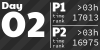
</a>

<a href="https://github.com/jenarvaezg/aoc2020/tree/main/src/solutions/day7.rs">
  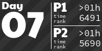
</a>

<a href="https://github.com/jenarvaezg/aoc2020/tree/main/src/solutions/day11.rs">
  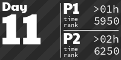
</a>
<a href="https://github.com/jenarvaezg/aoc2020/tree/main/src/solutions/day12.rs">
  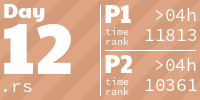
</a>
<a href="https://github.com/jenarvaezg/aoc2020/tree/main/src/solutions/day13.rs">
  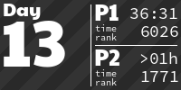
</a>

<h1 align="center">
  2019 - 36 ⭐
</h1>

<!-- AOC TILES END -->