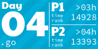

# adventofcode

:
<!-- AOC TILES BEGIN -->
<h1 align="center">
  2022 - 24 ⭐
</h1>

<h1 align="center">
  2021 - 36 ⭐
</h1>

<h1 align="center">
  2020 - 38 ⭐
</h1>

<h1 align="center">
  2019 - 36 ⭐
</h1>

<!-- AOC TILES END -->